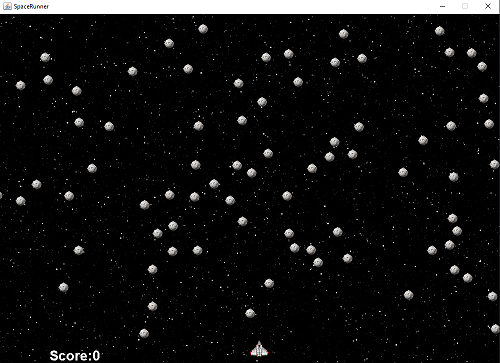

# SpaceRunner
This is a game made in java inspired in Atari's 1973 SpaceRace classic. The objective is reach the end of the screen without been hit. The game was tested in Windows.

# Song

The background song used in the game is Muriel from Bobby Richards.

# Sprites
There are 3 sprites located in the folder images. They are the following:

boost.png for rocket boost

meteor.png for obstacles

space.jpg for background

spaceship.jpg for spaceship

**Running:**
Install java sdk then go to src folder in terminal and type:

```
javac spacerunner/SpaceRunner.java
```
```
java spacerunner.SpaceRunner
```

# Controls
W and S to move the spaceship

# Game Preview


